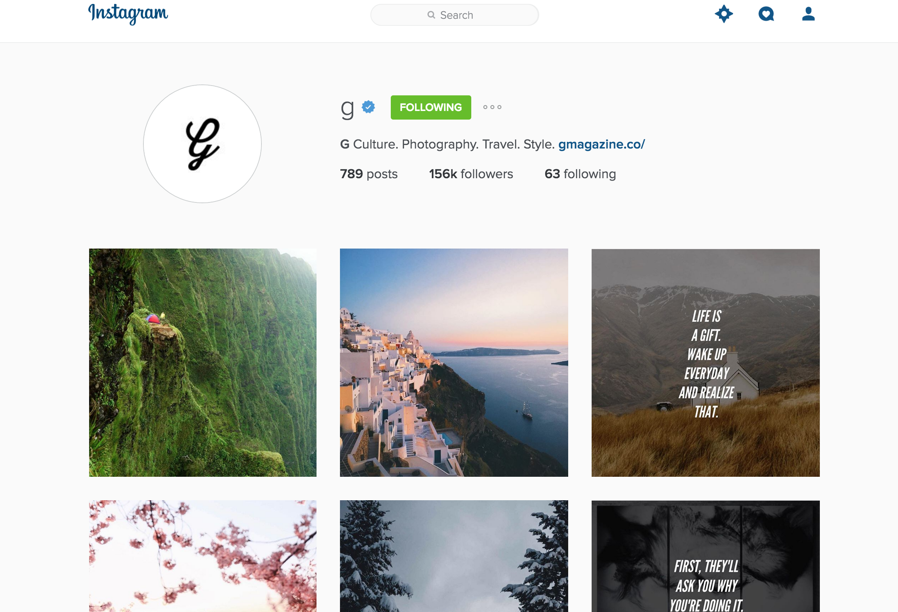

#### Projet-2 {Instagram-like}

Votre mission si vous l'acceptez (vous n'avez pas vraiment le choix enfait) est de re-créer l'appplication instagram ( le plus fidèlement possible):

# Instructions:
+ vous devrez faire ce projet en PHP, HTML & CSS
+ ainsi que le JS
   	+ vous devrez manipuler les éléments du DOM (le fameux). 
+ idéalement vous utiliserez SASS en guise de CSS
+ vous devriez utiliser un framwork CSS tel que  __*bootstrap*__

##  Règles:
+ Votre application devra être *responsive* (donc s'adapter à toutes les résolutions)
+ celui-ci aura 15 photos stockées en base de données
+ la possibilité de click pour voir le profil (une modal)
+ la photo du propriétaire doit être ronde. 
+ quand on click sur une photo :
	+ accès à la photo et les commentaires
+ on peut `liker`une photo.
+ on peut laisser des commentaires ( pourquoi pas utiliser Disqus ? ) 
+ Il n'y aura qu'__un dépôt git__

> Que la force et internet soit avec vous.

par un Anonyme.

> Pour critiquer les gens il faut les connaître, et pour les connaître, il faut les aimer.

 par Coluche.
