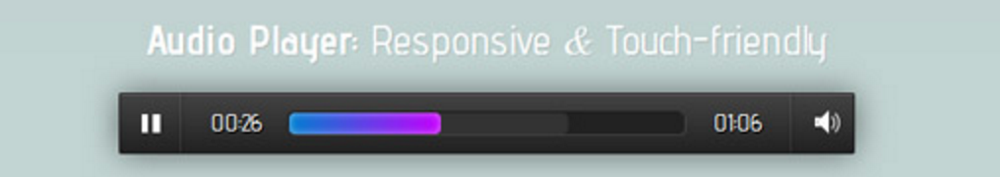

#### Projet-3 {Deezer or Spotify}
===

Votre mission qui ne peut être decliner sera de faire un lecteur audio web style (deezer/spotify):

# Instructions:
+ vous devrez faire le HTML & le CSS
+ ainsi que le JS
   	+ vous devrez manipuler les éléments du DOM (le fameux). 
+ idéalement vous devrer utilisez grunt  et/ou Sass[facultatif]
+ vous pourrez utiliser un framwork  __*bootstrap*__ ou __*foundation*__

##  Règles:
+ le lecteur devra être *reponsive* (donc s'adapter à toutes les résolutions)
+ celui-ci aura 5 pistes
+ la possibilité de faire piste suivante
+ la possibilité de faire piste précédante
+ mettre une image
+ mettre une progress bar pour l'avancement du/(de la) temps/piste
+ Il n'y aura qu'__un dépôt git__

> Que la force et internet soit avec vous.

par un Anonyme.

> Pour critiquer les gens il faut les connaître, et pour les connaître, il faut les aimer.

 par Coluche.

