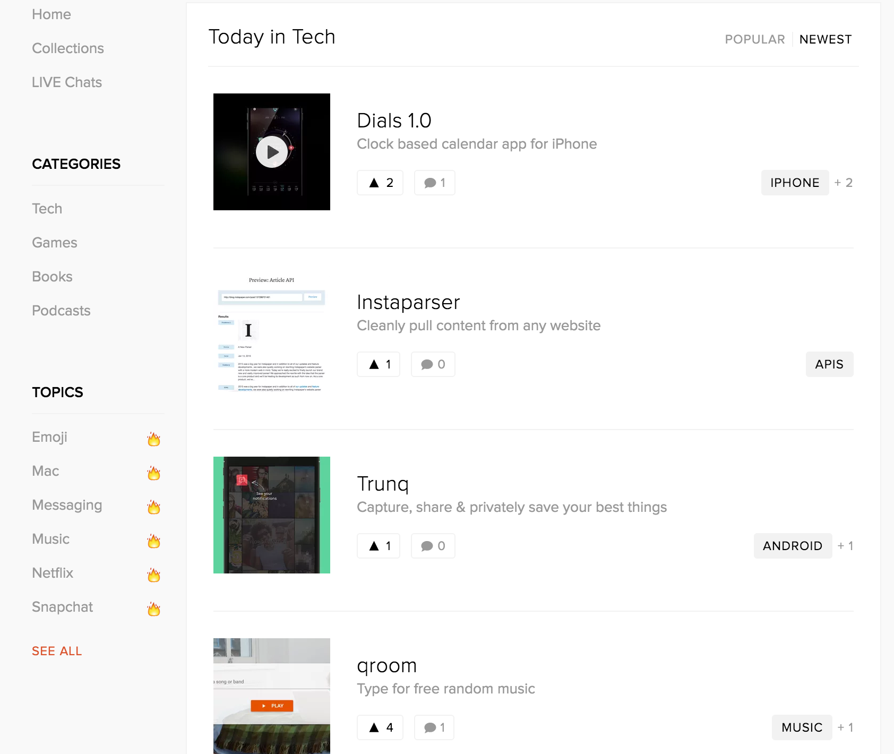

#### Projet-4 {Product-hunt-like}

Salut les gars! askip' vous êtes des devs et nous avons besoins de votre skill,
je vous implore de nous aidez à faire notre plateforme comme product-hunt/reddit (upvote/downvote):

# Instructions:
+ vous devrez faire le PHP, HTML & le CSS
+ ainsi que le JS
   	+ vous devrez manipuler les éléments du DOM (le fameux). 
+ idéalement vous utiliserez SASS en guise de CSS
+ vous pourrez utiliser un framwork  tel que __*bootstrap*__

##  Règles:
+ l'application devra être *responsive* (donc s'adapter à toutes les résolutions)
+ celui-ci aura 10 produits stockés en base de données
+ Chaque produit est associé à une catéogorie
+ On doit pouvoir upvote et downvote un produit
+ Les produits qui ont le plus de upvote apparaissent en haut
+ On peut naviguer dans les produits par catégorie
+ On peut déposer un commentaire sur un produit et voir tous les commentaires
+ lancer une modal de la carte lors du click
+ vous pouvez allez plus loins si vous le souhaitez.

> Que la force et internet soit avec vous.

par un Anonyme.

> Pour critiquer les gens il faut les connaître, et pour les connaître, il faut les aimer.

 par Coluche.
